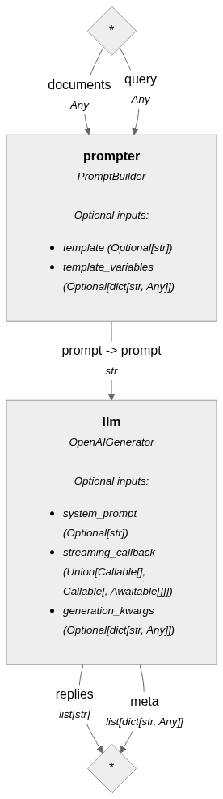
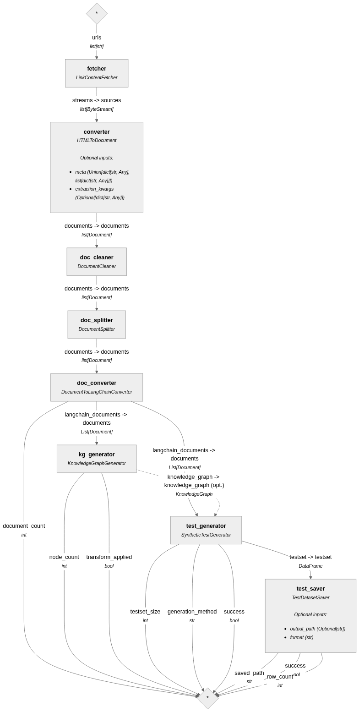

<h1 align="center">
Building Natural Language and LLM Pipelines, First Edition</h1>
<p align="center">This is the code repository for <a href ="building-natural-language-and-llm-pipelines-first-edition"> Building Natural Language and LLM Pipelines, First Edition</a>, published by Packt.
</p>

<h2 align="center">
An introduction to Haystack by Deepset
</h2>
<p align="center">
Laura Funderburk</p>

<p align="center">
   <a href="https://packt.link/I1tSU" alt="Discord" title="Learn more on the Discord server"></a>
  &#8287;&#8287;&#8287;&#8287;&#8287;
  <a href="https://packt.link/free-ebook/9781835467992"></a>
 &#8287;&#8287;&#8287;&#8287;&#8287;
  <a href="https://packt.link/gbp/9781835467992"></a>
  &#8287;&#8287;&#8287;&#8287;&#8287;
   <a href="https://www.amazon.com/Building-Natural-Language-Pipelines-introduction/dp/1835467997/ref=tmm_pap_swatch_0"></a>
  &#8287;&#8287;&#8287;&#8287;&#8287;
</p>
<details open>
  <summary><h2>About the book</summary>
<a href="https://www.packtpub.com/product/unity-cookbook-fifth-edition/9781805123026">

</a>

Building Natural Language Pipelines guides you through mastering LLM-powered applications using Haystack by deepset. From understanding Large Language Models to implementing production-ready NLP pipelines, this book covers it all.
You'll explore LLMs, learn to optimize their performance, and dive deep into the Haystack framework. Through hands-on projects, you'll build applications ranging from question-answering systems to sentiment analysis and semantic search engines. You'll learn to leverage Haystack's components and create custom ones. The book teaches you to package applications with Docker, enhance them with custom APIs, and apply best practices for scalable, well-documented projects. Real-world case studies demonstrate practical applications of these concepts.
By the end, you'll confidently design, implement, and deploy sophisticated NLP pipelines for various language processing challenges, equipping you with essential skills for building powerful, scalable NLP applications.
</details>
<details open>
  <summary><h2>Key Learnings</summary>
<ul>

<li>Understand LLMs and select the right one for your NLP tasks</li>

<li>Master techniques for interacting with and optimizing LLMs</li>

<li>Design and implement end-to-end NLP pipelines using Haystack</li>

<li>Build custom components to extend Haystack's functionality</li>

<li>Create production-ready applications with proper packaging and APIs</li>

<li>Implement real-world NLP projects like Q&A systems and search engines</li>

<li>Optimize NLP pipeline performance and mitigate common challenges</li>

<li>Stay updated with future trends in NLP and LLM applications</li>

</ul>

  </details>

<details open>
  <summary><h2>Chapters</summary>


| Chapters | Colab | Kaggle | Gradient | Studio Lab |
| :-------- | :-------- | :------- | :-------- | :-------- |
| **Chapter 1: Introduction to Natural Language Processing (NLP) pipelines** | | | | |
| **Chapter 2: Foundational concepts in NLP pipelines ** | | | | |
| <ul><li>01_prompt-ollama-model.ipynb</li></ul> | <a href="https://colab.research.google.com/github/PacktPublishing/Building-Natural-Language-and-LLM-Pipelines/blob/main/ch2/jupyter-notebooks/01_prompt-ollama-model.ipynb"></a><br> | <a href="https://www.kaggle.com/kernels/welcome?src=https://github.com/PacktPublishing/Building-Natural-Language-and-LLM-Pipelines/blob/main/ch2/jupyter-notebooks/01_prompt-ollama-model.ipynb"></a><br> | <a href="https://gradient.run/notebook/github.com/PacktPublishing/Building-Natural-Language-and-LLM-Pipelines/blob/main/ch2/jupyter-notebooks/01_prompt-ollama-model.ipynb"></a><br> | <a href="https://studiolab.sagemaker.aws/import/github/PacktPublishing/Building-Natural-Language-and-LLM-Pipelines/blob/main/ch2/jupyter-notebooks/01_prompt-ollama-model.ipynb"></a><br> |
| <ul><li>02_create-simple-agent.ipynb</li></ul> | <a href="https://colab.research.google.com/github/PacktPublishing/Building-Natural-Language-and-LLM-Pipelines/blob/main/ch2/jupyter-notebooks/02_create-simple-agent.ipynb"></a><br> | <a href="https://www.kaggle.com/kernels/welcome?src=https://github.com/PacktPublishing/Building-Natural-Language-and-LLM-Pipelines/blob/main/ch2/jupyter-notebooks/02_create-simple-agent.ipynb"></a><br> | <a href="https://gradient.run/notebook/github.com/PacktPublishing/Building-Natural-Language-and-LLM-Pipelines/blob/main/ch2/jupyter-notebooks/02_create-simple-agent.ipynb"></a><br> | <a href="https://studiolab.sagemaker.aws/import/github/PacktPublishing/Building-Natural-Language-and-LLM-Pipelines/blob/main/ch2/jupyter-notebooks/02_create-simple-agent.ipynb"></a><br> |
| <ul><li>03_document-qa-langchain.ipynb</li></ul> | <a href="https://colab.research.google.com/github/PacktPublishing/Building-Natural-Language-and-LLM-Pipelines/blob/main/ch2/jupyter-notebooks/03_document-qa-langchain.ipynb"></a><br> | <a href="https://www.kaggle.com/kernels/welcome?src=https://github.com/PacktPublishing/Building-Natural-Language-and-LLM-Pipelines/blob/main/ch2/jupyter-notebooks/03_document-qa-langchain.ipynb"></a><br> | <a href="https://gradient.run/notebook/github.com/PacktPublishing/Building-Natural-Language-and-LLM-Pipelines/blob/main/ch2/jupyter-notebooks/03_document-qa-langchain.ipynb"></a><br> | <a href="https://studiolab.sagemaker.aws/import/github/PacktPublishing/Building-Natural-Language-and-LLM-Pipelines/blob/main/ch2/jupyter-notebooks/03_document-qa-langchain.ipynb"></a><br> |
| <ul><li>02_middleware-tutorial.ipynb</li></ul> | <a href="https://colab.research.google.com/github/PacktPublishing/Building-Natural-Language-and-LLM-Pipelines/blob/main/ch2/jupyter-notebooks/advanced-langchain-langgraph/02_middleware-tutorial.ipynb"></a><br> | <a href="https://www.kaggle.com/kernels/welcome?src=https://github.com/PacktPublishing/Building-Natural-Language-and-LLM-Pipelines/blob/main/ch2/jupyter-notebooks/advanced-langchain-langgraph/02_middleware-tutorial.ipynb"></a><br> | <a href="https://gradient.run/notebook/github.com/PacktPublishing/Building-Natural-Language-and-LLM-Pipelines/blob/main/ch2/jupyter-notebooks/advanced-langchain-langgraph/02_middleware-tutorial.ipynb"></a><br> | <a href="https://studiolab.sagemaker.aws/import/github/PacktPublishing/Building-Natural-Language-and-LLM-Pipelines/blob/main/ch2/jupyter-notebooks/advanced-langchain-langgraph/02_middleware-tutorial.ipynb"></a><br> |
| <ul><li>03_multi-agent-workflow.ipynb</li></ul> | <a href="https://colab.research.google.com/github/PacktPublishing/Building-Natural-Language-and-LLM-Pipelines/blob/main/ch2/jupyter-notebooks/advanced-langchain-langgraph/03_multi-agent-workflow.ipynb"></a><br> | <a href="https://www.kaggle.com/kernels/welcome?src=https://github.com/PacktPublishing/Building-Natural-Language-and-LLM-Pipelines/blob/main/ch2/jupyter-notebooks/advanced-langchain-langgraph/03_multi-agent-workflow.ipynb"></a><br> | <a href="https://gradient.run/notebook/github.com/PacktPublishing/Building-Natural-Language-and-LLM-Pipelines/blob/main/ch2/jupyter-notebooks/advanced-langchain-langgraph/03_multi-agent-workflow.ipynb"></a><br> | <a href="https://studiolab.sagemaker.aws/import/github/PacktPublishing/Building-Natural-Language-and-LLM-Pipelines/blob/main/ch2/jupyter-notebooks/advanced-langchain-langgraph/03_multi-agent-workflow.ipynb"></a><br> |
| <ul><li>04_understanding-state-graph.ipynb</li></ul> | <a href="https://colab.research.google.com/github/PacktPublishing/Building-Natural-Language-and-LLM-Pipelines/blob/main/ch2/jupyter-notebooks/advanced-langchain-langgraph/04_understanding-state-graph.ipynb"></a><br> | <a href="https://www.kaggle.com/kernels/welcome?src=https://github.com/PacktPublishing/Building-Natural-Language-and-LLM-Pipelines/blob/main/ch2/jupyter-notebooks/advanced-langchain-langgraph/04_understanding-state-graph.ipynb"></a><br> | <a href="https://gradient.run/notebook/github.com/PacktPublishing/Building-Natural-Language-and-LLM-Pipelines/blob/main/ch2/jupyter-notebooks/advanced-langchain-langgraph/04_understanding-state-graph.ipynb"></a><br> | <a href="https://studiolab.sagemaker.aws/import/github/PacktPublishing/Building-Natural-Language-and-LLM-Pipelines/blob/main/ch2/jupyter-notebooks/advanced-langchain-langgraph/04_understanding-state-graph.ipynb"></a><br> |
| <ul><li>05_graph-based-agent-with-tools.ipynb</li></ul> | <a href="https://colab.research.google.com/github/PacktPublishing/Building-Natural-Language-and-LLM-Pipelines/blob/main/ch2/jupyter-notebooks/advanced-langchain-langgraph/05_graph-based-agent-with-tools.ipynb"></a><br> | <a href="https://www.kaggle.com/kernels/welcome?src=https://github.com/PacktPublishing/Building-Natural-Language-and-LLM-Pipelines/blob/main/ch2/jupyter-notebooks/advanced-langchain-langgraph/05_graph-based-agent-with-tools.ipynb"></a><br> | <a href="https://gradient.run/notebook/github.com/PacktPublishing/Building-Natural-Language-and-LLM-Pipelines/blob/main/ch2/jupyter-notebooks/advanced-langchain-langgraph/05_graph-based-agent-with-tools.ipynb"></a><br> | <a href="https://studiolab.sagemaker.aws/import/github/PacktPublishing/Building-Natural-Language-and-LLM-Pipelines/blob/main/ch2/jupyter-notebooks/advanced-langchain-langgraph/05_graph-based-agent-with-tools.ipynb"></a><br> |
| <ul><li>06_multi-agent-systems-middleware.ipynb</li></ul> | <a href="https://colab.research.google.com/github/PacktPublishing/Building-Natural-Language-and-LLM-Pipelines/blob/main/ch2/jupyter-notebooks/advanced-langchain-langgraph/06_multi-agent-systems-middleware.ipynb"></a><br> | <a href="https://www.kaggle.com/kernels/welcome?src=https://github.com/PacktPublishing/Building-Natural-Language-and-LLM-Pipelines/blob/main/ch2/jupyter-notebooks/advanced-langchain-langgraph/06_multi-agent-systems-middleware.ipynb"></a><br> | <a href="https://gradient.run/notebook/github.com/PacktPublishing/Building-Natural-Language-and-LLM-Pipelines/blob/main/ch2/jupyter-notebooks/advanced-langchain-langgraph/06_multi-agent-systems-middleware.ipynb"></a><br> | <a href="https://studiolab.sagemaker.aws/import/github/PacktPublishing/Building-Natural-Language-and-LLM-Pipelines/blob/main/ch2/jupyter-notebooks/advanced-langchain-langgraph/06_multi-agent-systems-middleware.ipynb"></a><br> |
| **Chapter 3: Introduction to Haystack by Deepset** | | | | |
| <ul><li>components.ipynb</li></ul> | <a href="https://colab.research.google.com/github/PacktPublishing/Building-Natural-Language-and-LLM-Pipelines/blob/main/ch3/jupyter-notebooks/components.ipynb"></a><br> | <a href="https://www.kaggle.com/kernels/welcome?src=https://github.com/PacktPublishing/Building-Natural-Language-and-LLM-Pipelines/blob/main/ch3/jupyter-notebooks/components.ipynb"></a><br> | <a href="https://gradient.run/notebook/github.com/PacktPublishing/Building-Natural-Language-and-LLM-Pipelines/blob/main/ch3/jupyter-notebooks/components.ipynb"></a><br> | <a href="https://studiolab.sagemaker.aws/import/github/PacktPublishing/Building-Natural-Language-and-LLM-Pipelines/blob/main/ch3/jupyter-notebooks/components.ipynb"></a><br> |
| <ul><li>supercomponents.ipynb</li></ul> | <a href="https://colab.research.google.com/github/PacktPublishing/Building-Natural-Language-and-LLM-Pipelines/blob/main/ch3/jupyter-notebooks/supercomponents.ipynb"></a><br> | <a href="https://www.kaggle.com/kernels/welcome?src=https://github.com/PacktPublishing/Building-Natural-Language-and-LLM-Pipelines/blob/main/ch3/jupyter-notebooks/supercomponents.ipynb"></a><br> | <a href="https://gradient.run/notebook/github.com/PacktPublishing/Building-Natural-Language-and-LLM-Pipelines/blob/main/ch3/jupyter-notebooks/supercomponents.ipynb"></a><br> | <a href="https://studiolab.sagemaker.aws/import/github/PacktPublishing/Building-Natural-Language-and-LLM-Pipelines/blob/main/ch3/jupyter-notebooks/supercomponents.ipynb"></a><br> |
| <ul><li>your-first-custom-component.ipynb</li></ul> | <a href="https://colab.research.google.com/github/PacktPublishing/Building-Natural-Language-and-LLM-Pipelines/blob/main/ch3/jupyter-notebooks/your-first-custom-component.ipynb"></a><br> | <a href="https://www.kaggle.com/kernels/welcome?src=https://github.com/PacktPublishing/Building-Natural-Language-and-LLM-Pipelines/blob/main/ch3/jupyter-notebooks/your-first-custom-component.ipynb"></a><br> | <a href="https://gradient.run/notebook/github.com/PacktPublishing/Building-Natural-Language-and-LLM-Pipelines/blob/main/ch3/jupyter-notebooks/your-first-custom-component.ipynb"></a><br> | <a href="https://studiolab.sagemaker.aws/import/github/PacktPublishing/Building-Natural-Language-and-LLM-Pipelines/blob/main/ch3/jupyter-notebooks/your-first-custom-component.ipynb"></a><br> |
| <ul><li>your-first-pipeline.ipynb</li></ul> | <a href="https://colab.research.google.com/github/PacktPublishing/Building-Natural-Language-and-LLM-Pipelines/blob/main/ch3/jupyter-notebooks/your-first-pipeline.ipynb"></a><br> | <a href="https://www.kaggle.com/kernels/welcome?src=https://github.com/PacktPublishing/Building-Natural-Language-and-LLM-Pipelines/blob/main/ch3/jupyter-notebooks/your-first-pipeline.ipynb"></a><br> | <a href="https://gradient.run/notebook/github.com/PacktPublishing/Building-Natural-Language-and-LLM-Pipelines/blob/main/ch3/jupyter-notebooks/your-first-pipeline.ipynb"></a><br> | <a href="https://studiolab.sagemaker.aws/import/github/PacktPublishing/Building-Natural-Language-and-LLM-Pipelines/blob/main/ch3/jupyter-notebooks/your-first-pipeline.ipynb"></a><br> |
| **Chapter 4: Bringing components together: Haystack pipelines for different use cases** | | | | |
| <ul><li>async_hybrid_pipeline.ipynb</li></ul> | <a href="https://colab.research.google.com/github/PacktPublishing/Building-Natural-Language-and-LLM-Pipelines/blob/main/ch4/jupyter-notebooks/async_hybrid_pipeline.ipynb"></a><br> | <a href="https://www.kaggle.com/kernels/welcome?src=https://github.com/PacktPublishing/Building-Natural-Language-and-LLM-Pipelines/blob/main/ch4/jupyter-notebooks/async_hybrid_pipeline.ipynb"></a><br> | <a href="https://gradient.run/notebook/github.com/PacktPublishing/Building-Natural-Language-and-LLM-Pipelines/blob/main/ch4/jupyter-notebooks/async_hybrid_pipeline.ipynb"></a><br> | <a href="https://studiolab.sagemaker.aws/import/github/PacktPublishing/Building-Natural-Language-and-LLM-Pipelines/blob/main/ch4/jupyter-notebooks/async_hybrid_pipeline.ipynb"></a><br> |
| <ul><li>hybrid_pipeline.ipynb</li></ul> | <a href="https://colab.research.google.com/github/PacktPublishing/Building-Natural-Language-and-LLM-Pipelines/blob/main/ch4/jupyter-notebooks/hybrid_pipeline.ipynb"></a><br> | <a href="https://www.kaggle.com/kernels/welcome?src=https://github.com/PacktPublishing/Building-Natural-Language-and-LLM-Pipelines/blob/main/ch4/jupyter-notebooks/hybrid_pipeline.ipynb"></a><br> | <a href="https://gradient.run/notebook/github.com/PacktPublishing/Building-Natural-Language-and-LLM-Pipelines/blob/main/ch4/jupyter-notebooks/hybrid_pipeline.ipynb"></a><br> | <a href="https://studiolab.sagemaker.aws/import/github/PacktPublishing/Building-Natural-Language-and-LLM-Pipelines/blob/main/ch4/jupyter-notebooks/hybrid_pipeline.ipynb"></a><br> |
| <ul><li>indexing_pipeline.ipynb</li></ul> | <a href="https://colab.research.google.com/github/PacktPublishing/Building-Natural-Language-and-LLM-Pipelines/blob/main/ch4/jupyter-notebooks/indexing_pipeline.ipynb"></a><br> | <a href="https://www.kaggle.com/kernels/welcome?src=https://github.com/PacktPublishing/Building-Natural-Language-and-LLM-Pipelines/blob/main/ch4/jupyter-notebooks/indexing_pipeline.ipynb"></a><br> | <a href="https://gradient.run/notebook/github.com/PacktPublishing/Building-Natural-Language-and-LLM-Pipelines/blob/main/ch4/jupyter-notebooks/indexing_pipeline.ipynb"></a><br> | <a href="https://studiolab.sagemaker.aws/import/github/PacktPublishing/Building-Natural-Language-and-LLM-Pipelines/blob/main/ch4/jupyter-notebooks/indexing_pipeline.ipynb"></a><br> |
| <ul><li>1_image_embeddings_with_clip.ipynb</li></ul> | <a href="https://colab.research.google.com/github/PacktPublishing/Building-Natural-Language-and-LLM-Pipelines/blob/main/ch4/jupyter-notebooks/multimodal/1_image_embeddings_with_clip.ipynb"></a><br> | <a href="https://www.kaggle.com/kernels/welcome?src=https://github.com/PacktPublishing/Building-Natural-Language-and-LLM-Pipelines/blob/main/ch4/jupyter-notebooks/multimodal/1_image_embeddings_with_clip.ipynb"></a><br> | <a href="https://gradient.run/notebook/github.com/PacktPublishing/Building-Natural-Language-and-LLM-Pipelines/blob/main/ch4/jupyter-notebooks/multimodal/1_image_embeddings_with_clip.ipynb"></a><br> | <a href="https://studiolab.sagemaker.aws/import/github/PacktPublishing/Building-Natural-Language-and-LLM-Pipelines/blob/main/ch4/jupyter-notebooks/multimodal/1_image_embeddings_with_clip.ipynb"></a><br> |
| <ul><li>2_multimodal_indexing_clip.ipynb</li></ul> | <a href="https://colab.research.google.com/github/PacktPublishing/Building-Natural-Language-and-LLM-Pipelines/blob/main/ch4/jupyter-notebooks/multimodal/2_multimodal_indexing_clip.ipynb"></a><br> | <a href="https://www.kaggle.com/kernels/welcome?src=https://github.com/PacktPublishing/Building-Natural-Language-and-LLM-Pipelines/blob/main/ch4/jupyter-notebooks/multimodal/2_multimodal_indexing_clip.ipynb"></a><br> | <a href="https://gradient.run/notebook/github.com/PacktPublishing/Building-Natural-Language-and-LLM-Pipelines/blob/main/ch4/jupyter-notebooks/multimodal/2_multimodal_indexing_clip.ipynb"></a><br> | <a href="https://studiolab.sagemaker.aws/import/github/PacktPublishing/Building-Natural-Language-and-LLM-Pipelines/blob/main/ch4/jupyter-notebooks/multimodal/2_multimodal_indexing_clip.ipynb"></a><br> |
| <ul><li>3_multimodal_indexing_llm.ipynb</li></ul> | <a href="https://colab.research.google.com/github/PacktPublishing/Building-Natural-Language-and-LLM-Pipelines/blob/main/ch4/jupyter-notebooks/multimodal/3_multimodal_indexing_llm.ipynb"></a><br> | <a href="https://www.kaggle.com/kernels/welcome?src=https://github.com/PacktPublishing/Building-Natural-Language-and-LLM-Pipelines/blob/main/ch4/jupyter-notebooks/multimodal/3_multimodal_indexing_llm.ipynb"></a><br> | <a href="https://gradient.run/notebook/github.com/PacktPublishing/Building-Natural-Language-and-LLM-Pipelines/blob/main/ch4/jupyter-notebooks/multimodal/3_multimodal_indexing_llm.ipynb"></a><br> | <a href="https://studiolab.sagemaker.aws/import/github/PacktPublishing/Building-Natural-Language-and-LLM-Pipelines/blob/main/ch4/jupyter-notebooks/multimodal/3_multimodal_indexing_llm.ipynb"></a><br> |
| <ul><li>4_multimodal_rag_vision_llm.ipynb</li></ul> | <a href="https://colab.research.google.com/github/PacktPublishing/Building-Natural-Language-and-LLM-Pipelines/blob/main/ch4/jupyter-notebooks/multimodal/4_multimodal_rag_vision_llm.ipynb"></a><br> | <a href="https://www.kaggle.com/kernels/welcome?src=https://github.com/PacktPublishing/Building-Natural-Language-and-LLM-Pipelines/blob/main/ch4/jupyter-notebooks/multimodal/4_multimodal_rag_vision_llm.ipynb"></a><br> | <a href="https://gradient.run/notebook/github.com/PacktPublishing/Building-Natural-Language-and-LLM-Pipelines/blob/main/ch4/jupyter-notebooks/multimodal/4_multimodal_rag_vision_llm.ipynb"></a><br> | <a href="https://studiolab.sagemaker.aws/import/github/PacktPublishing/Building-Natural-Language-and-LLM-Pipelines/blob/main/ch4/jupyter-notebooks/multimodal/4_multimodal_rag_vision_llm.ipynb"></a><br> |
| <ul><li>5_audio_transcription_whisper.ipynb</li></ul> | <a href="https://colab.research.google.com/github/PacktPublishing/Building-Natural-Language-and-LLM-Pipelines/blob/main/ch4/jupyter-notebooks/multimodal/5_audio_transcription_whisper.ipynb"></a><br> | <a href="https://www.kaggle.com/kernels/welcome?src=https://github.com/PacktPublishing/Building-Natural-Language-and-LLM-Pipelines/blob/main/ch4/jupyter-notebooks/multimodal/5_audio_transcription_whisper.ipynb"></a><br> | <a href="https://gradient.run/notebook/github.com/PacktPublishing/Building-Natural-Language-and-LLM-Pipelines/blob/main/ch4/jupyter-notebooks/multimodal/5_audio_transcription_whisper.ipynb"></a><br> | <a href="https://studiolab.sagemaker.aws/import/github/PacktPublishing/Building-Natural-Language-and-LLM-Pipelines/blob/main/ch4/jupyter-notebooks/multimodal/5_audio_transcription_whisper.ipynb"></a><br> |
| <ul><li>conditional_router.ipynb</li></ul> | <a href="https://colab.research.google.com/github/PacktPublishing/Building-Natural-Language-and-LLM-Pipelines/blob/main/ch4/jupyter-notebooks/routers/conditional_router.ipynb"></a><br> | <a href="https://www.kaggle.com/kernels/welcome?src=https://github.com/PacktPublishing/Building-Natural-Language-and-LLM-Pipelines/blob/main/ch4/jupyter-notebooks/routers/conditional_router.ipynb"></a><br> | <a href="https://gradient.run/notebook/github.com/PacktPublishing/Building-Natural-Language-and-LLM-Pipelines/blob/main/ch4/jupyter-notebooks/routers/conditional_router.ipynb"></a><br> | <a href="https://studiolab.sagemaker.aws/import/github/PacktPublishing/Building-Natural-Language-and-LLM-Pipelines/blob/main/ch4/jupyter-notebooks/routers/conditional_router.ipynb"></a><br> |
| <ul><li>metadata_router.ipynb</li></ul> | <a href="https://colab.research.google.com/github/PacktPublishing/Building-Natural-Language-and-LLM-Pipelines/blob/main/ch4/jupyter-notebooks/routers/metadata_router.ipynb"></a><br> | <a href="https://www.kaggle.com/kernels/welcome?src=https://github.com/PacktPublishing/Building-Natural-Language-and-LLM-Pipelines/blob/main/ch4/jupyter-notebooks/routers/metadata_router.ipynb"></a><br> | <a href="https://gradient.run/notebook/github.com/PacktPublishing/Building-Natural-Language-and-LLM-Pipelines/blob/main/ch4/jupyter-notebooks/routers/metadata_router.ipynb"></a><br> | <a href="https://studiolab.sagemaker.aws/import/github/PacktPublishing/Building-Natural-Language-and-LLM-Pipelines/blob/main/ch4/jupyter-notebooks/routers/metadata_router.ipynb"></a><br> |
| <ul><li>text_language_router.ipynb</li></ul> | <a href="https://colab.research.google.com/github/PacktPublishing/Building-Natural-Language-and-LLM-Pipelines/blob/main/ch4/jupyter-notebooks/routers/text_language_router.ipynb"></a><br> | <a href="https://www.kaggle.com/kernels/welcome?src=https://github.com/PacktPublishing/Building-Natural-Language-and-LLM-Pipelines/blob/main/ch4/jupyter-notebooks/routers/text_language_router.ipynb"></a><br> | <a href="https://gradient.run/notebook/github.com/PacktPublishing/Building-Natural-Language-and-LLM-Pipelines/blob/main/ch4/jupyter-notebooks/routers/text_language_router.ipynb"></a><br> | <a href="https://studiolab.sagemaker.aws/import/github/PacktPublishing/Building-Natural-Language-and-LLM-Pipelines/blob/main/ch4/jupyter-notebooks/routers/text_language_router.ipynb"></a><br> |
| <ul><li>semantic_search_pipeline.ipynb</li></ul> | <a href="https://colab.research.google.com/github/PacktPublishing/Building-Natural-Language-and-LLM-Pipelines/blob/main/ch4/jupyter-notebooks/semantic_search_pipeline.ipynb"></a><br> | <a href="https://www.kaggle.com/kernels/welcome?src=https://github.com/PacktPublishing/Building-Natural-Language-and-LLM-Pipelines/blob/main/ch4/jupyter-notebooks/semantic_search_pipeline.ipynb"></a><br> | <a href="https://gradient.run/notebook/github.com/PacktPublishing/Building-Natural-Language-and-LLM-Pipelines/blob/main/ch4/jupyter-notebooks/semantic_search_pipeline.ipynb"></a><br> | <a href="https://studiolab.sagemaker.aws/import/github/PacktPublishing/Building-Natural-Language-and-LLM-Pipelines/blob/main/ch4/jupyter-notebooks/semantic_search_pipeline.ipynb"></a><br> |
| <ul><li>supercomponents_and_agentic_rag.ipynb</li></ul> | <a href="https://colab.research.google.com/github/PacktPublishing/Building-Natural-Language-and-LLM-Pipelines/blob/main/ch4/jupyter-notebooks/supercomponents_and_agentic_rag.ipynb"></a><br> | <a href="https://www.kaggle.com/kernels/welcome?src=https://github.com/PacktPublishing/Building-Natural-Language-and-LLM-Pipelines/blob/main/ch4/jupyter-notebooks/supercomponents_and_agentic_rag.ipynb"></a><br> | <a href="https://gradient.run/notebook/github.com/PacktPublishing/Building-Natural-Language-and-LLM-Pipelines/blob/main/ch4/jupyter-notebooks/supercomponents_and_agentic_rag.ipynb"></a><br> | <a href="https://studiolab.sagemaker.aws/import/github/PacktPublishing/Building-Natural-Language-and-LLM-Pipelines/blob/main/ch4/jupyter-notebooks/supercomponents_and_agentic_rag.ipynb"></a><br> |
| **Chapter 5: Haystack pipeline development with custom components ** | | | | |
| <ul><li>advanced_branching_pipeline.ipynb</li></ul> | <a href="https://colab.research.google.com/github/PacktPublishing/Building-Natural-Language-and-LLM-Pipelines/blob/main/ch5/jupyter-notebooks/advanced_branching_pipeline.ipynb"></a><br> | <a href="https://www.kaggle.com/kernels/welcome?src=https://github.com/PacktPublishing/Building-Natural-Language-and-LLM-Pipelines/blob/main/ch5/jupyter-notebooks/advanced_branching_pipeline.ipynb"></a><br> | <a href="https://gradient.run/notebook/github.com/PacktPublishing/Building-Natural-Language-and-LLM-Pipelines/blob/main/ch5/jupyter-notebooks/advanced_branching_pipeline.ipynb"></a><br> | <a href="https://studiolab.sagemaker.aws/import/github/PacktPublishing/Building-Natural-Language-and-LLM-Pipelines/blob/main/ch5/jupyter-notebooks/advanced_branching_pipeline.ipynb"></a><br> |
| <ul><li>pdf_knowledge_graph_pipeline.ipynb</li></ul> | <a href="https://colab.research.google.com/github/PacktPublishing/Building-Natural-Language-and-LLM-Pipelines/blob/main/ch5/jupyter-notebooks/pdf_knowledge_graph_pipeline.ipynb"></a><br> | <a href="https://www.kaggle.com/kernels/welcome?src=https://github.com/PacktPublishing/Building-Natural-Language-and-LLM-Pipelines/blob/main/ch5/jupyter-notebooks/pdf_knowledge_graph_pipeline.ipynb"></a><br> | <a href="https://gradient.run/notebook/github.com/PacktPublishing/Building-Natural-Language-and-LLM-Pipelines/blob/main/ch5/jupyter-notebooks/pdf_knowledge_graph_pipeline.ipynb"></a><br> | <a href="https://studiolab.sagemaker.aws/import/github/PacktPublishing/Building-Natural-Language-and-LLM-Pipelines/blob/main/ch5/jupyter-notebooks/pdf_knowledge_graph_pipeline.ipynb"></a><br> |
| <ul><li>prefixed_custom-component.ipynb</li></ul> | <a href="https://colab.research.google.com/github/PacktPublishing/Building-Natural-Language-and-LLM-Pipelines/blob/main/ch5/jupyter-notebooks/prefixed_custom-component.ipynb"></a><br> | <a href="https://www.kaggle.com/kernels/welcome?src=https://github.com/PacktPublishing/Building-Natural-Language-and-LLM-Pipelines/blob/main/ch5/jupyter-notebooks/prefixed_custom-component.ipynb"></a><br> | <a href="https://gradient.run/notebook/github.com/PacktPublishing/Building-Natural-Language-and-LLM-Pipelines/blob/main/ch5/jupyter-notebooks/prefixed_custom-component.ipynb"></a><br> | <a href="https://studiolab.sagemaker.aws/import/github/PacktPublishing/Building-Natural-Language-and-LLM-Pipelines/blob/main/ch5/jupyter-notebooks/prefixed_custom-component.ipynb"></a><br> |
| <ul><li>warmup_component.ipynb</li></ul> | <a href="https://colab.research.google.com/github/PacktPublishing/Building-Natural-Language-and-LLM-Pipelines/blob/main/ch5/jupyter-notebooks/warmup_component.ipynb"></a><br> | <a href="https://www.kaggle.com/kernels/welcome?src=https://github.com/PacktPublishing/Building-Natural-Language-and-LLM-Pipelines/blob/main/ch5/jupyter-notebooks/warmup_component.ipynb"></a><br> | <a href="https://gradient.run/notebook/github.com/PacktPublishing/Building-Natural-Language-and-LLM-Pipelines/blob/main/ch5/jupyter-notebooks/warmup_component.ipynb"></a><br> | <a href="https://studiolab.sagemaker.aws/import/github/PacktPublishing/Building-Natural-Language-and-LLM-Pipelines/blob/main/ch5/jupyter-notebooks/warmup_component.ipynb"></a><br> |
| <ul><li>web_knowledge_graph_pipeline.ipynb</li></ul> | <a href="https://colab.research.google.com/github/PacktPublishing/Building-Natural-Language-and-LLM-Pipelines/blob/main/ch5/jupyter-notebooks/web_knowledge_graph_pipeline.ipynb"></a><br> | <a href="https://www.kaggle.com/kernels/welcome?src=https://github.com/PacktPublishing/Building-Natural-Language-and-LLM-Pipelines/blob/main/ch5/jupyter-notebooks/web_knowledge_graph_pipeline.ipynb"></a><br> | <a href="https://gradient.run/notebook/github.com/PacktPublishing/Building-Natural-Language-and-LLM-Pipelines/blob/main/ch5/jupyter-notebooks/web_knowledge_graph_pipeline.ipynb"></a><br> | <a href="https://studiolab.sagemaker.aws/import/github/PacktPublishing/Building-Natural-Language-and-LLM-Pipelines/blob/main/ch5/jupyter-notebooks/web_knowledge_graph_pipeline.ipynb"></a><br> |
| **Chapter 6: Setting up a reproducible project: Q&A pipeline** | | | | |
| <ul><li>add_observability_with_wandb.ipynb</li></ul> | <a href="https://colab.research.google.com/github/PacktPublishing/Building-Natural-Language-and-LLM-Pipelines/blob/main/ch6/jupyter-notebooks/add_observability_with_wandb.ipynb"></a><br> | <a href="https://www.kaggle.com/kernels/welcome?src=https://github.com/PacktPublishing/Building-Natural-Language-and-LLM-Pipelines/blob/main/ch6/jupyter-notebooks/add_observability_with_wandb.ipynb"></a><br> | <a href="https://gradient.run/notebook/github.com/PacktPublishing/Building-Natural-Language-and-LLM-Pipelines/blob/main/ch6/jupyter-notebooks/add_observability_with_wandb.ipynb"></a><br> | <a href="https://studiolab.sagemaker.aws/import/github/PacktPublishing/Building-Natural-Language-and-LLM-Pipelines/blob/main/ch6/jupyter-notebooks/add_observability_with_wandb.ipynb"></a><br> |
| <ul><li>get_started_rag_evaluation_with_ragas.ipynb</li></ul> | <a href="https://colab.research.google.com/github/PacktPublishing/Building-Natural-Language-and-LLM-Pipelines/blob/main/ch6/jupyter-notebooks/get_started_rag_evaluation_with_ragas.ipynb"></a><br> | <a href="https://www.kaggle.com/kernels/welcome?src=https://github.com/PacktPublishing/Building-Natural-Language-and-LLM-Pipelines/blob/main/ch6/jupyter-notebooks/get_started_rag_evaluation_with_ragas.ipynb"></a><br> | <a href="https://gradient.run/notebook/github.com/PacktPublishing/Building-Natural-Language-and-LLM-Pipelines/blob/main/ch6/jupyter-notebooks/get_started_rag_evaluation_with_ragas.ipynb"></a><br> | <a href="https://studiolab.sagemaker.aws/import/github/PacktPublishing/Building-Natural-Language-and-LLM-Pipelines/blob/main/ch6/jupyter-notebooks/get_started_rag_evaluation_with_ragas.ipynb"></a><br> |
| <ul><li>ragas_evaluation_with_custom_components.ipynb</li></ul> | <a href="https://colab.research.google.com/github/PacktPublishing/Building-Natural-Language-and-LLM-Pipelines/blob/main/ch6/jupyter-notebooks/ragas_evaluation_with_custom_components.ipynb"></a><br> | <a href="https://www.kaggle.com/kernels/welcome?src=https://github.com/PacktPublishing/Building-Natural-Language-and-LLM-Pipelines/blob/main/ch6/jupyter-notebooks/ragas_evaluation_with_custom_components.ipynb"></a><br> | <a href="https://gradient.run/notebook/github.com/PacktPublishing/Building-Natural-Language-and-LLM-Pipelines/blob/main/ch6/jupyter-notebooks/ragas_evaluation_with_custom_components.ipynb"></a><br> | <a href="https://studiolab.sagemaker.aws/import/github/PacktPublishing/Building-Natural-Language-and-LLM-Pipelines/blob/main/ch6/jupyter-notebooks/ragas_evaluation_with_custom_components.ipynb"></a><br> |
| **Chapter 7: Deploying Haystack-based applications** | | | | |
| **Chapter 8: Hands-on Projects** | | | | |
| <ul><li>tool-calling.ipynb</li></ul> | <a href="https://colab.research.google.com/github/PacktPublishing/Building-Natural-Language-and-LLM-Pipelines/blob/main/ch8/haystack-agents/tool-calling.ipynb"></a><br> | <a href="https://www.kaggle.com/kernels/welcome?src=https://github.com/PacktPublishing/Building-Natural-Language-and-LLM-Pipelines/blob/main/ch8/haystack-agents/tool-calling.ipynb"></a><br> | <a href="https://gradient.run/notebook/github.com/PacktPublishing/Building-Natural-Language-and-LLM-Pipelines/blob/main/ch8/haystack-agents/tool-calling.ipynb"></a><br> | <a href="https://studiolab.sagemaker.aws/import/github/PacktPublishing/Building-Natural-Language-and-LLM-Pipelines/blob/main/ch8/haystack-agents/tool-calling.ipynb"></a><br> |
| <ul><li>ner-with-haystack-search-pipeline.ipynb</li></ul> | <a href="https://colab.research.google.com/github/PacktPublishing/Building-Natural-Language-and-LLM-Pipelines/blob/main/ch8/named-entity-recognition/ner-with-haystack-search-pipeline.ipynb"></a><br> | <a href="https://www.kaggle.com/kernels/welcome?src=https://github.com/PacktPublishing/Building-Natural-Language-and-LLM-Pipelines/blob/main/ch8/named-entity-recognition/ner-with-haystack-search-pipeline.ipynb"></a><br> | <a href="https://gradient.run/notebook/github.com/PacktPublishing/Building-Natural-Language-and-LLM-Pipelines/blob/main/ch8/named-entity-recognition/ner-with-haystack-search-pipeline.ipynb"></a><br> | <a href="https://studiolab.sagemaker.aws/import/github/PacktPublishing/Building-Natural-Language-and-LLM-Pipelines/blob/main/ch8/named-entity-recognition/ner-with-haystack-search-pipeline.ipynb"></a><br> |
| <ul><li>classification-with-haystack-search-pipeline.ipynb</li></ul> | <a href="https://colab.research.google.com/github/PacktPublishing/Building-Natural-Language-and-LLM-Pipelines/blob/main/ch8/text-classification/classification-with-haystack-search-pipeline.ipynb"></a><br> | <a href="https://www.kaggle.com/kernels/welcome?src=https://github.com/PacktPublishing/Building-Natural-Language-and-LLM-Pipelines/blob/main/ch8/text-classification/classification-with-haystack-search-pipeline.ipynb"></a><br> | <a href="https://gradient.run/notebook/github.com/PacktPublishing/Building-Natural-Language-and-LLM-Pipelines/blob/main/ch8/text-classification/classification-with-haystack-search-pipeline.ipynb"></a><br> | <a href="https://studiolab.sagemaker.aws/import/github/PacktPublishing/Building-Natural-Language-and-LLM-Pipelines/blob/main/ch8/text-classification/classification-with-haystack-search-pipeline.ipynb"></a><br> |
| <ul><li>classification-ner-agent-exercise.ipynb</li></ul> | <a href="https://colab.research.google.com/github/PacktPublishing/Building-Natural-Language-and-LLM-Pipelines/blob/main/ch8/text-classification/haystack-agents-mini-project/classification-ner-agent-exercise.ipynb"></a><br> | <a href="https://www.kaggle.com/kernels/welcome?src=https://github.com/PacktPublishing/Building-Natural-Language-and-LLM-Pipelines/blob/main/ch8/text-classification/haystack-agents-mini-project/classification-ner-agent-exercise.ipynb"></a><br> | <a href="https://gradient.run/notebook/github.com/PacktPublishing/Building-Natural-Language-and-LLM-Pipelines/blob/main/ch8/text-classification/haystack-agents-mini-project/classification-ner-agent-exercise.ipynb"></a><br> | <a href="https://studiolab.sagemaker.aws/import/github/PacktPublishing/Building-Natural-Language-and-LLM-Pipelines/blob/main/ch8/text-classification/haystack-agents-mini-project/classification-ner-agent-exercise.ipynb"></a><br> |
| <ul><li>sentiment_analysis.ipynb</li></ul> | <a href="https://colab.research.google.com/github/PacktPublishing/Building-Natural-Language-and-LLM-Pipelines/blob/main/ch8/text-classification/sentiment_analysis.ipynb"></a><br> | <a href="https://www.kaggle.com/kernels/welcome?src=https://github.com/PacktPublishing/Building-Natural-Language-and-LLM-Pipelines/blob/main/ch8/text-classification/sentiment_analysis.ipynb"></a><br> | <a href="https://gradient.run/notebook/github.com/PacktPublishing/Building-Natural-Language-and-LLM-Pipelines/blob/main/ch8/text-classification/sentiment_analysis.ipynb"></a><br> | <a href="https://studiolab.sagemaker.aws/import/github/PacktPublishing/Building-Natural-Language-and-LLM-Pipelines/blob/main/ch8/text-classification/sentiment_analysis.ipynb"></a><br> |
| <ul><li>text-classification.ipynb</li></ul> | <a href="https://colab.research.google.com/github/PacktPublishing/Building-Natural-Language-and-LLM-Pipelines/blob/main/ch8/text-classification/text-classification.ipynb"></a><br> | <a href="https://www.kaggle.com/kernels/welcome?src=https://github.com/PacktPublishing/Building-Natural-Language-and-LLM-Pipelines/blob/main/ch8/text-classification/text-classification.ipynb"></a><br> | <a href="https://gradient.run/notebook/github.com/PacktPublishing/Building-Natural-Language-and-LLM-Pipelines/blob/main/ch8/text-classification/text-classification.ipynb"></a><br> | <a href="https://studiolab.sagemaker.aws/import/github/PacktPublishing/Building-Natural-Language-and-LLM-Pipelines/blob/main/ch8/text-classification/text-classification.ipynb"></a><br> |
| <ul><li>haystack_agent_with_tools.ipynb</li></ul> | <a href="https://colab.research.google.com/github/PacktPublishing/Building-Natural-Language-and-LLM-Pipelines/blob/main/ch8/yelp-navigator/haystack_agent_with_tools.ipynb"></a><br> | <a href="https://www.kaggle.com/kernels/welcome?src=https://github.com/PacktPublishing/Building-Natural-Language-and-LLM-Pipelines/blob/main/ch8/yelp-navigator/haystack_agent_with_tools.ipynb"></a><br> | <a href="https://gradient.run/notebook/github.com/PacktPublishing/Building-Natural-Language-and-LLM-Pipelines/blob/main/ch8/yelp-navigator/haystack_agent_with_tools.ipynb"></a><br> | <a href="https://studiolab.sagemaker.aws/import/github/PacktPublishing/Building-Natural-Language-and-LLM-Pipelines/blob/main/ch8/yelp-navigator/haystack_agent_with_tools.ipynb"></a><br> |
| <ul><li>haystack_looping_supervisor.ipynb</li></ul> | <a href="https://colab.research.google.com/github/PacktPublishing/Building-Natural-Language-and-LLM-Pipelines/blob/main/ch8/yelp-navigator/haystack_looping_supervisor.ipynb"></a><br> | <a href="https://www.kaggle.com/kernels/welcome?src=https://github.com/PacktPublishing/Building-Natural-Language-and-LLM-Pipelines/blob/main/ch8/yelp-navigator/haystack_looping_supervisor.ipynb"></a><br> | <a href="https://gradient.run/notebook/github.com/PacktPublishing/Building-Natural-Language-and-LLM-Pipelines/blob/main/ch8/yelp-navigator/haystack_looping_supervisor.ipynb"></a><br> | <a href="https://studiolab.sagemaker.aws/import/github/PacktPublishing/Building-Natural-Language-and-LLM-Pipelines/blob/main/ch8/yelp-navigator/haystack_looping_supervisor.ipynb"></a><br> |
| <ul><li>langgraph_multiagent_supervisor.ipynb</li></ul> | <a href="https://colab.research.google.com/github/PacktPublishing/Building-Natural-Language-and-LLM-Pipelines/blob/main/ch8/yelp-navigator/langgraph_multiagent_supervisor.ipynb"></a><br> | <a href="https://www.kaggle.com/kernels/welcome?src=https://github.com/PacktPublishing/Building-Natural-Language-and-LLM-Pipelines/blob/main/ch8/yelp-navigator/langgraph_multiagent_supervisor.ipynb"></a><br> | <a href="https://gradient.run/notebook/github.com/PacktPublishing/Building-Natural-Language-and-LLM-Pipelines/blob/main/ch8/yelp-navigator/langgraph_multiagent_supervisor.ipynb"></a><br> | <a href="https://studiolab.sagemaker.aws/import/github/PacktPublishing/Building-Natural-Language-and-LLM-Pipelines/blob/main/ch8/yelp-navigator/langgraph_multiagent_supervisor.ipynb"></a><br> |
| <ul><li>pipeline_chaining_guide.ipynb</li></ul> | <a href="https://colab.research.google.com/github/PacktPublishing/Building-Natural-Language-and-LLM-Pipelines/blob/main/ch8/yelp-navigator/pipeline_chaining_guide.ipynb"></a><br> | <a href="https://www.kaggle.com/kernels/welcome?src=https://github.com/PacktPublishing/Building-Natural-Language-and-LLM-Pipelines/blob/main/ch8/yelp-navigator/pipeline_chaining_guide.ipynb"></a><br> | <a href="https://gradient.run/notebook/github.com/PacktPublishing/Building-Natural-Language-and-LLM-Pipelines/blob/main/ch8/yelp-navigator/pipeline_chaining_guide.ipynb"></a><br> | <a href="https://studiolab.sagemaker.aws/import/github/PacktPublishing/Building-Natural-Language-and-LLM-Pipelines/blob/main/ch8/yelp-navigator/pipeline_chaining_guide.ipynb"></a><br> |
| **Chapter 9: Future Trends and Beyond** | | | | |


</details>


<details open>
  <summary><h2>Requirements for this book</summary>

  To be filled
  </details>


<details>
  <summary><h2>Get to know Authors</h2></summary>

_Laura Funderburk_ Laura Funderburk works as a Developer Advocate for Ploomber, an organization focused on improving the MLOps lifecycle. As a Developer Advocate, Laura combines her passion for MLOps, SQL, and data engineering, with her love for community outreach. Prior to this, Laura held positions as a Data Scientist and DevOps engineer in a variety of settings, including academia, non-for-profit and private sectors. Laura obtained a Machine Learning Engineering certification from the University of California San Diego, and a Bachelor of Mathematics from Simon Fraser University. Since the introduction of Large Language Models, Laura has dedicated her time to learning how to package, productionize and automate data extraction, processing and retrieval through LLMs and open-source packages, and has found a framework she loves in Haystack. When not immersed in building pipelines and engaging with the open-source community, Laura trains Brazilian Jiu-jitsu.


</details>
<details>
  <summary><h2>Other Related Books</h2></summary>
<ul>

  <li><a href="https://www.packtpub.com/en-us/product/mastering-nlp-from-foundations-to-agents-second-edition/9781806106134">Mastering NLP From Foundations to Agents, Second Edition</a></li>

  <li><a href="https://www.packtpub.com/en-us/product/context-engineering--for-multi-agent-systems-first-edition/9781806690053">Context Engineering  for Multi-Agent Systems, First Edition</a></li>

</ul>

</details>


<details>
  <summary><h2>Note From Authors end:</h2></summary>
<ul>


## Table of Contents

- [What You'll Learn to Build](#what-youll-learn-to-build)
- [Setting Up](#setting-up)
- [Chapter Breakdown](#chapter-breakdown)
  - Chapter 1: Introduction to natural language processing pipelines (no required code exercises)
  - [Chapter 2: Diving Deep into Large Language Models](#chapter-2-diving-deep-into-large-language-models)
  - [Chapter 3: Introduction to Haystack](#chapter-3-introduction-to-haystack)
  - [Chapter 4: Bringing components together: Haystack pipelines for different use cases](#chapter-4-bringing-components-together-haystack-pipelines-for-different-use-cases)
  - [Chapter 5: Haystack pipeline development with custom components](#chapter-5-haystack-pipeline-development-with-custom-components)
  - [Chapter 6: Setting up a reproducible project: naive vs hybrid RAG with reranking and evaluation](#chapter-6-setting-up-a-reproducible-project-naive-vs-hybrid-rag-with-reranking-and-evaluation)
  - [Chapter 7: Production deployment strategies](#chapter-7-production-deployment-strategies)
  - [Chapter 8: Hands-on projects](#chapter-8-hands-on-projects)
  - Chapter 9: Future trends and beyond (no required code exercises)
  - [Optional: Advanced multi-agent architecture for production](#optional---advanced-langgraph-supervisor-patterns-for-production)


## What You'll Learn to Build

This book guides you through building advanced **Retrieval-Augmented Generation (RAG)** systems and **multi-agent applications** using the [Haystack 2.0](https://haystack.deepset.ai/), [Ragas](https://docs.ragas.io/en/stable/) and [LangGraph](https://www.langchain.com/langgraph) frameworks. Beginning with **state-based agent development** using LangGraph, you'll learn to build intelligent agents with tool integration, middleware patterns, and multi-agent coordination. You'll then master **Haystack's component architecture**, progressing through creating intelligent search systems with semantic and hybrid retrieval, building custom components for specialized tasks, and implementing comprehensive evaluation frameworks. The journey advances through production deployment strategies with Docker and REST APIs, culminating in hands-on projects including named entity recognition systems, zero-shot text classification pipelines, sentiment analysis tools, and sophisticated multi-agent orchestration systems that coordinate multiple specialized Haystack pipelines through supervisor-worker patterns with LangGraph.

<strong>Chapter 2: Single agents and multi agents with LangChain and LangGraph</strong>

This chapter contains optional LangGraph demonstrations that introduce state-based agents at a conceptual level.
These examples are previews intended to build intuition.
The full, practical use of LangGraph for multi-agent orchestration appears later in Chapter 8 and the epilogue, once the Haystack tool layer has been fully developed.

| | | 
|-|-|
| Agent with one tool | Agent calling supervisor | 
|  | |


<details>
<summary><strong>Chapter 3: Building robust agent tools with Haystack</strong></summary>

| | |
|-|-|
| Supercomponents and pipeline | Prompt template pipeline| 
|  |  | 

</details>

<details>
<summary><strong>Chapter 4: RAG pipelines: indexing and retrieval for text-based and multimodal pipelines (image and audio)</strong></summary>

| | | 
|-|-|
| Indexing pipeline | Hybrid RAG pipeline| 
| | 

</details>

<details>
<summary><strong>Chapter 5: Build custom components: synthetic data generation with Ragas</strong></summary>

| | | 
|-|-|
| Knowledge graph and synthetic data generation (SDG) pipeline | SDG applied to websites and PDFS |
| | 

</details>


<strong>Chapter 6: Reproducible evaluation of hybrid and naive RAG with Ragas and Weights and Biases</strong>


<strong>Chapter 7: Deploy pipelines as an API with FastAPI and Hayhooks</strong>


<strong>Chapter 8 and Optional Advanced Modules: Capstone and Agentic Patterns for Production<strong>

| | | 
|-|-|
| Microservice architecture| Multi-agent system using microservices|
|  | |

> ** Sovereign-Friendly & Local Execution**: The majority of exercises throughout this book are written so you can choose between **OpenAI APIs** or **local models via Ollama** (such as [Mistral Nemo](https://ollama.com/library/mistral-nemo), [GPT-OSS](https://ollama.com/library/gpt-oss), or [Deepseek-R1](https://ollama.com/library/deepseek-r1) and [Qwen3](https://ollama.com/library/qwen3)), with the exception of the cost tracking exercises in Chapter 6 which specifically demonstrate OpenAI API usage monitoring. Each notebook provides specific model recommendations to help you choose the most suitable option for that particular exercise. The frameworks explored are extensible and models from other providers can be used to substitute OpenAI or local models. No US cloud, external APIs, or proprietary services are required for the majority of the book, making it easy to run in EU-regulated or air-gapped environments. The [epilogue](./epilogue/) folder includes an optional prototype-to-production multi-agent implementation with LangGraph using LangSmith Studio. These exercises require a free [LangSmith Studio](https://docs.langchain.com/oss/javascript/langgraph/studio) API key, all exercises can also be run entirely locally and you can disable the tracer `export LANGCHAIN_TRACING_V2="false"`. Scripts are provided so you can run the agent on your terminal - you simply wont see the studio traces or visualize the agent if you choose not to use LangSmith studio.

## Setting up

Clone the repository

```bash
git clone https://github.com/PacktPublishing/Building-Natural-Language-Pipelines.git

cd Building-Natural-Language-Pipelines/

```

Each chapter contains a `pyproject.toml` file with the folder's dependencies. **(Recommended) Open each folder in a new VS Code window.**

1. **Install [uv](https://docs.astral.sh/uv/getting-started/installation/):**
	```sh
	pip install uv
	```
2. **Change directories into the folder**
3. **Install dependencies:**
	```sh
	uv sync
	```
4. **Activate the virtual environment:**
	```sh
	source .venv/bin/activate
	```
5. **Select the virtual environment as the Jupyter kernel:**
	- Open any notebook.
	- Click the kernel picker (top right) and select the `.venv` environment.

---

## Chapter breakdown

### **[Chapter 2: Diving Deep into Large Language Models](./ch2/)**
**Agent Foundations & State Management**
- **LangGraph Fundamentals**: Understanding state-based agent frameworks and graph architecture
- **Building Simple Agents**: Creating agents with state management using MessagesState and reducers
- **Tool Integration**: Connecting agents with external tools (search APIs, databases, custom functions)
- **Multi-Agent Systems**: Designing and coordinating multiple specialized agents in workflows
- **Middleware Patterns**: Implementing logging, authentication, and monitoring layers for agent systems
- **Local vs Cloud LLMs**: Running agents with OpenAI APIs or locally with Ollama (Qwen2, Llama, Mistral)

### **[Chapter 3: Introduction to Haystack](./ch3/)**
**Core Concepts & Foundation**
- **Component Architecture**: Understanding Haystack's modular design patterns
- **Pipeline Construction**: Building linear and branching data flow pipelines  
- **Document Processing**: Text extraction, cleaning, and preprocessing workflows
- **Prompting LLMs**: Learn to build prompt templates and guide how an LLM responds
- **Package pipelines as Supercomponents**: Abstract a pipeline as a Haystack component

### **[Chapter 4: Bringing components together: Haystack pipelines for different use cases](./ch4/)**
**Scaling & Optimization**
- **Indexing Pipelines**: Automated document ingestion and preprocessing workflows
- **Naive RAG**: Semantic search using sentence transformers and embedding models
- **Hybrid RAG**: Combining keyword (BM25) and semantic (vector) search strategies
- **Reranking**: Advanced retrieval techniques using ranker models
- **Multimodal Pipelines**: Processing and analyzing images alongside text data

### **[Chapter 5: Haystack pipeline development with custom components](./ch5/)**
**Extensibility & Testing**
- **Component SDK**: Creating custom Haystack components with proper interfaces
- **Knowledge Graph Integration**: Building components for structured knowledge representation
- **Synthetic Data Generation**: Automated test data creation for pipeline validation
- **Quality Control Systems**: Implementing automated evaluation and monitoring components
- **Unit Testing Frameworks**: Comprehensive testing strategies for custom components

### **[Chapter 6: Setting up a reproducible project: naive vs hybrid RAG with reranking and evaluation](./ch6/)**
**Reproducible Workflows & Evaluation**
- **Reproducible Workflow Building Blocks**: Setting up consistent environments with Docker, Elasticsearch, and dependency management
- **Naive RAG Implementation**: Building basic retrieval-augmented generation with semantic search
- **Hybrid RAG with Reranking**: Advanced retrieval combining keyword (BM25) and semantic search with rank fusion strategies
- **Evaluation with RAGAS**: Using the RAGAS framework to assess and compare naive vs hybrid RAG system quality across multiple dimensions
- **Observability with Weights and Biases**: Implementing monitoring and tracking for RAG system performance comparison and experiment management
- **Performance Optimization through Feedback Loops**: Creating iterative improvement cycles using evaluation results to enhance retrieval and generation performance

### **Chapter 7: Production deployment strategies**
**Deployment & Scaling**

#### **[Deploying a Retriever Pipeline as FastAPI App](./ch7/)**
- **FastAPI REST API**: Building production-ready APIs with clean documentation and error handling
- **Docker Containerization**: Full containerization with Docker Compose for scalable deployments
- **Qdrant Integration**: Production-grade document storage and hybrid search capabilities
- **Local Development Workflows**: Script-based development environment setup and testing

#### **[Deploying Multiple Pipelines with Hayhooks](./ch7-hayhooks/)**
- **Hayhooks Framework**: Multi-pipeline deployment using Haystack's native REST API framework
- **Pipeline Orchestration**: Managing multiple RAG pipelines (indexing + querying) as microservices
- **Service Discovery**: Automated API endpoint generation and pipeline management

### **[Chapter 8: Hands-on projects](./ch8/)**
**Real-World Applications & Multi-Agent Systems**

Hands-on projects that progress from beginner to advanced complexity, focusing on Named Entity Recognition, Text Classification, and Multi-Agent Systems. Projects includes complete notebooks with custom component definition, pipeline definition, and pipeline serialization.

#### **[Named Entity Recognition (NER) - Beginner](./ch8/named-entity-recognition/)**
- **Haystack Pipeline Fundamentals**: Building basic pipelines for entity extraction workflows
- **Pre-trained NER Models**: Using transformer models to identify people, organizations, and locations
- **Custom Component Creation**: Developing reusable components for text processing
- **Web Content Processing**: Building pipelines that extract entities from web search results
- **SuperComponents and Agents**: Wrapping pipelines as tools and building agents for natural language interaction

#### **[Text Classification & Sentiment Analysis - Intermediate](./ch8/text-classification/)**
- **Zero-Shot Classification**: Categorizing content without training data using LLMs
- **External API Integration**: Connecting Haystack pipelines with the Yelp API
- **Model Performance Evaluation**: Assessing classification accuracy on labeled datasets
- **Sentiment Analysis Pipelines**: Building custom components for analyzing review sentiment
- **Haystack Agent Mini Project**: Hands-on exercise combining NER and classification pipelines with agent orchestration and Hayhooks deployment

#### **[Yelp Navigator - Multi-Agent System - Advanced](./ch8/yelp-navigator/)**
- **Modular Pipeline Architecture**: Creating 3 specialized pipelines (business search, details, sentiment) with NER and text classification
- **Hayhooks Deployment**: Deploying pipelines as REST API endpoints for agent consumption
- **Pipeline Chaining**: Connecting multiple specialized Haystack pipelines into complex workflows
- **LangGraph Multi-Agent Orchestration**: Building intelligent supervisor systems that coordinate specialized agents
- **Case study**: Can we achieve the same fluid dynamic reasoning with Haystack primitives

### **[Optional - Advanced LangGraph Supervisor Patterns for Production](./epilogue/)**

This folder contains an extended, production-grade implementation of the agentic supervisor described in Chapter 8.

- **Three Agent Architectures**: Progressive implementations from learning (V1 monolithic) to production-ready (V3 with checkpointing)
- **State Management Patterns**: Understanding how architectural decisions impact token usage and cost (16-50% reduction)
- **Monolithic vs Supervisor Patterns**: Comparing design approaches with automated token measurement tools
- **Production Features**: Error handling with retry policies, conversation persistence with checkpointing, and graceful degradation
- **Guardrails**: Input validation with prompt injection detection and PII sanitization for secure agent interactions
- **Checkpointing Systems**: Thread-based session management with both in-memory (development) and SQLite (production) persistence options


</ul>

</details>
