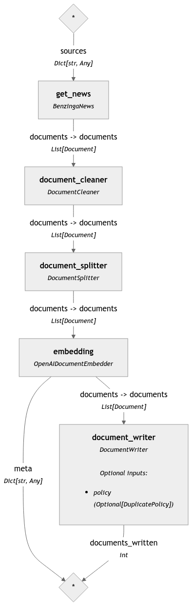
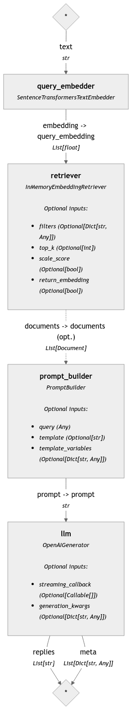
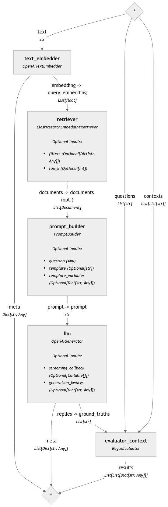

# Description

Exercises for Chapter 6. "Setting up a reproducible project: question and answer pipeline "

## Topics covered

* Reproducible workflow building blocks  

* Setting up a Q&A System: 

1. Case I: Q&A system for small collection of text 

2. Case II: Q&A system for complex knowledge bases 

* Incorporating observability and evaluation of results 

* Optimizing performance through a feedback loop 

## Technical requirements

To follow along and successfully implement the concepts discussed in this chapter, you need to set up a proper development environment. The main technical requirement is Python, which will be used to manage the dependencies and run the necessary code for the project. Specifically, you need: 

Python 3.12 or Higher 

The project is designed to work with Python 3.12, so ensure you have this version installed. If not, consider using a tool like pyenv to manage and install the correct Python version. 

### Dependency Management 

We will use just scripts and uv for managing dependencies efficiently. These tools allow us to handle virtual environments and package installation seamlessly. For more information, visit https://github.com/casey/just and https://astral.sh/blog/uv  to perform installation. Installation guide for just can be found here https://github.com/casey/just?tab=readme-ov-file#installation 

It is also suggested to use pyenv to manage Python versions https://github.com/pyenv/pyenv, installation instructions can be found here https://github.com/pyenv/pyenv?tab=readme-ov-file#installation  

You can set Python 3.12 globally as follows: 

```bash
$ pyenv global system 3.12 
```

* Virtual Environment: We recommend creating a virtual environment to isolate the project dependencies and avoid conflicts with other Python installations. 

* `pipx`: While optional, using pipx for managing command-line tools like uv can simplify dependency installation and management. 

* Docker desktop installed: We will be using a Docker image for Elastic Search to populate our vector database. https://www.docker.com/products/docker-desktop/. 

### Libraries and Packages 

The project requires several Python libraries, which will be installed through the provided justfile. The main libraries include: 

* Haystack for building the Q&A pipeline 
* OpenAI for embedding generation 
* Additional utilities like BeautifulSoup, dotenv, and more for pre-processing and environment management. 
* Bonus: Bytewax for real time processing 

We will add these as part of a `pyproject.toml` file found [here](../pyproject.toml). 

By ensuring these requirements are met, you'll be able to set up a reproducible and scalable environment for the Q&A pipeline project. 

### Executing with `just` 

In this folder, we have prepared a `justfile` to ensure this process is as smooth as possible. To get started, and once you have installed all requirements, run

```bash
just get-started
```

This will create a `venvs` folder. Activate

```bash
. venvs/bin/dev activate
```

### Execute Elastic Search

Enable Docker and run

```bash
docker compose up
```

To run an image for an Elastic Search instance

To add new dependencies, modify the dependencies in the [pyproject.toml](./pyproject.toml) file then run

```bash
just develop
```

to update. 

## Pipelines

### Case I: Q&A for simple text with custom components

Ensure you have an OpenAI key and have stored it into a `.env` file under a variable name such as `OPENAI_API_KEY`

The pipelines can be found here:

1. [Indexing pipeline with custom components to extract, chunk and embed information from a JSONL file](./case-I-q-and-a-dataset/indexingpipeline.py)
2. [Querying pipeline with prompt templating to retrieve information](./case-I-q-and-a-dataset/query_pipeline.png)



Indexing pipeline



Query pipeline

### Case II: Q&A for a complex knowledge base

Ensure you have an OpenAI key and have stored it into a `.env` file under a variable name such as `OPENAI_API_KEY`

The notebook includes an indexing pipeline to extract, chunk and embed information from the Haystack tutorials as well as a querying pipeline with a specific role (software engineer) to build code from the tutorials.

[Notebook](./case-II-q-and-a-complex/rag-tutorials.ipynb)

### Adding evaluation and observability 

We included two examples. You can get started with a simple example that logs token usage and time to perform embedding. 

* [Add logging with Weights and Biases - indexing](./adding-observability/indexing_pipeline.py)
* [Add logging with Weights and Biases - querying](./adding-observability/query_pipeline.py)

This assumes you have created a Weights and Biases account, and that you have an API key, ensure to store it as part of an `.env` file under a variable name such as `WANDB_API_KEY`. 

* [Add evaluation with RAGAS - query pipeline](./adding-evaluation/query_pipeline.py)

The complete RAGAS query pipeline can be visualized as follows


