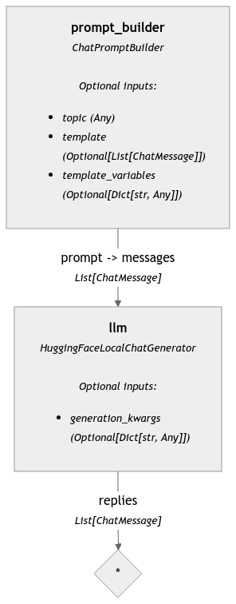

## Pipeline serilization and deployment with Hayhooks

This assumes we have installed the package "hayhooks". This can be handled using `just develop` and the pyproject.toml file provided in the chapter.

To serialize a pipeline, simply build a Haystack pipeline and run the `.dumps()` method. This will create a YAML representation of the pipeline. A simple example is outlined in [here](./sample_pipeline.py). This pipeline can be visualized in YAML format [as follows](./chat_pipeline.yaml).

To deploy the pipeline using Hayhooks, run

```bash
hayhooks run
```

Open a second terminal, then check it's running

```bash
hayhooks status
```

To deploy a pipeline, run

```bash
hayhooks deploy chat_pipeline.yaml
```

You can visit the documentation of the endpoint in `http://localhost:1416/docs#`

To draw the pipeline, run

```bash
curl -X 'GET' \
  'http://localhost:1416/draw/chat_pipeline' \
  -H 'accept: application/json'
```

This pipeline can be visualized as follows 



To undeploy the pipeline, run

```bash
hayhooks undeploy chat_pipeline
```