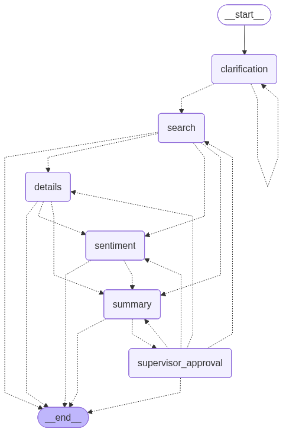

# LangGraph Multi-Agent Supervisor Guide

## Overview

This guide walks you through running the **LangGraph Multi-Agent Supervisor** system - an intelligent orchestration layer that coordinates multiple specialized agents to search for businesses on Yelp and generate comprehensive reports.

### What Does This Application Do?

The multi-agent system automates the process of finding and analyzing businesses:

1. **Understands your request** - Clarifies what you're looking for, where, and how much detail you need
2. **Searches intelligently** - Finds relevant businesses using natural language queries
3. **Gathers details conditionally** - Based on detail level, fetches website information and customer reviews
4. **Synthesizes results** - Creates a human-readable summary with recommendations
5. **Quality control** - Supervisor approval reviews output and can request revisions

### Real-World Example

**You ask:** "I'm looking for good Mexican restaurants in Austin, Texas. I want to see customer reviews."

**The system:**
- **Clarification Agent** extracts: query="Mexican restaurants", location="Austin, Texas", detail_level="reviews"
- **Search Agent** finds 10+ restaurants with ratings and locations
- **Details Agent** (activated because detail_level="reviews") fetches website content for each restaurant
- **Sentiment Agent** (activated because detail_level="reviews") analyzes customer reviews and identifies positive/negative themes
- **Summary Agent** generates a comprehensive report with top recommendations
- **Supervisor Approval** reviews the summary and approves or requests revisions

## Architecture



The system uses **conditional routing** where agents are activated based on the requested detail level:

```
User Query
    ↓
Clarification Agent ────┐
    ↓                   │ (loops if unclear,
Search Agent            │  max 2 attempts)
    ↓                   ↓
[Details Agent] ←─── optional: "detailed" or "reviews" level
    ↓
[Sentiment Agent] ←─── optional: only for "reviews" level
    ↓
Summary Agent
    ↓
Supervisor Approval ←─── can request revisions (max 2 attempts)
    ↓
Final Report
```

### Agent Roles

| Agent | Purpose | When It Runs |
|-------|---------|--------------|
| **Clarification** | Extracts query, location, and detail level from user input | Always (first step) |
| **Search** | Finds businesses using Yelp API via Pipeline 1 | Always (after clarification) |
| **Details** | Fetches website content via Pipeline 2 | Conditionally: "detailed" or "reviews" level |
| **Sentiment** | Analyzes customer reviews via Pipeline 3 | Conditionally: only for "reviews" level |
| **Summary** | Synthesizes all results into readable report | Always (before approval) |
| **Supervisor Approval** | Reviews summary quality and can request revisions | Always (final step) |

## Prerequisites

### 1. Yelp Navigator Pipelines

**You must complete the [Yelp Navigator Pipeline Setup](yelp-navigator-hayhooks-guide.md) first.**

This multi-agent system depends on the Haystack pipelines being built and running:

- Pipeline 1: Business Search with NER
- Pipeline 2: Business Details Fetcher
- Pipeline 3: Reviews & Sentiment Analysis

### 2. Hayhooks Server Running

Start the Hayhooks server to expose pipeline endpoints:

```bash
cd /path/to/yelp-navigator
uv run hayhooks run --pipelines-dir pipelines
```

Verify it's running:
```bash
curl http://localhost:1416/status
```

You should see pipeline endpoints listed.

### 3. API Keys Configured

Ensure your `.env` file has:
```bash
OPENAI_API_KEY=your_openai_key_here
RAPID_API_KEY=your_rapidapi_key_here  # Must be valid and subscribed to Yelp Business Reviews API
```


## Getting Started

Open the Jupyter notebook [found here](./langgraph_multiagent_supervisor.ipynb)


### Run Examples

The notebook includes 4 example scenarios. Run them one at a time to see how the system behaves.

#### Example 1: General Search (Basic Info Only)

**What it does:** Simple query asking for basic business information only

**Expected behavior:**
- Clarification agent identifies: "Mexican restaurants", "Austin, Texas", "general" detail level
- Search Agent calls Pipeline 1 and finds businesses
- Summary Agent creates report (no Details or Sentiment agents activated)
- Supervisor Approval reviews and approves the summary

---

#### Example 2: Detailed Search (With Website Info)

**What it does:** Request that needs website information

**Expected behavior:**
- Clarification agent identifies: "Italian restaurants", "San Francisco", "detailed" level
- Search Agent calls Pipeline 1 and finds businesses
- Details Agent (activated due to "detailed" level) calls Pipeline 2 for website content
- Summary includes business info + website summaries
- Supervisor Approval reviews and approves


---

#### Example 3: Full Analysis (With Reviews)

**What it does:** Complete analysis including customer sentiment

**Expected behavior:**
- Clarification agent identifies: "coffee shops", "Portland, Oregon", "reviews" level
- Search Agent calls Pipeline 1 and finds businesses
- Details Agent (activated due to "reviews" level) calls Pipeline 2 for website content
- Sentiment Agent (activated due to "reviews" level) calls Pipeline 3 for review analysis
- Summary includes everything: basic info, websites, and review sentiment
- Supervisor Approval reviews and approves (or requests revisions)


---

#### Example 4: Ambiguous Query

**What it does:** Tests fallback behavior with unclear input

**Expected behavior:**
- Clarification agent tries to extract info
- After 2 attempts, uses defaults to prevent infinite loop
- System proceeds with default values


## Understanding the Output

Each example shows:

1. **Agent Messages** - Step-by-step conversation showing what each agent did
2. **Search Results** - Number of businesses found and top results
3. **Agent Outputs** - Results from Details/Sentiment agents (if activated)
4. **Final Summary** - Human-readable report synthesizing all information
